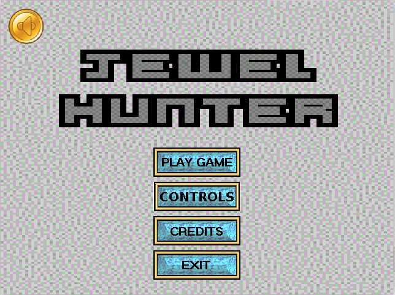
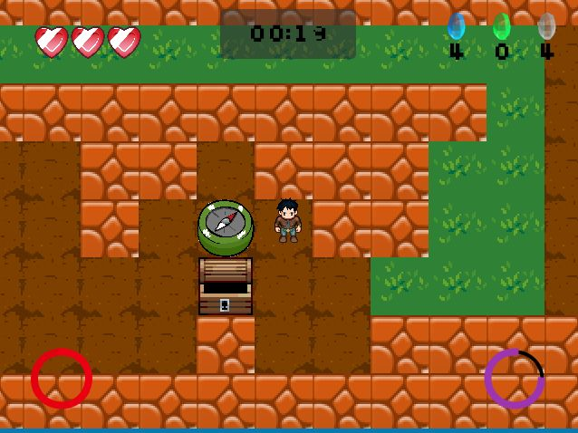
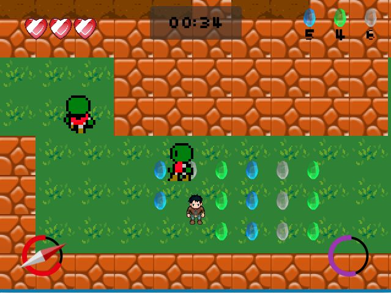
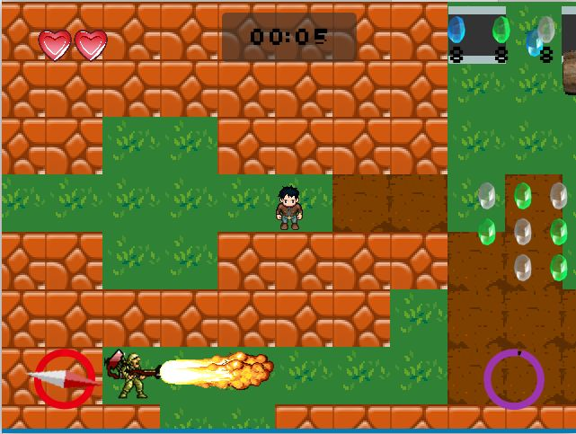
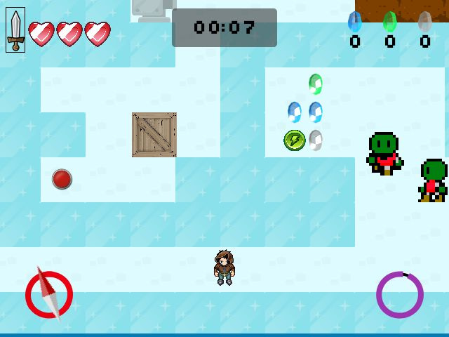

# JewelHunter
It's a java based 2D game, which brings fun to the players with easy and interesting paths for collecting many objects to accelerate through the levels of the game. My intention was to create a tile-based game in which the user collects jewels on interesting paths.

Game consists of 4 stages and has a story where the Queen will make a soldier a Knight once he steals the Kohinoor. Candidates have to go through a multiple stages where they can encounter a guard, it can have a flamethrower, and lasers are installed in various parts. Also one needs to save themselves from rolling barrels.

The player can collect various equipment which can be compass, sword or a speed slower tool which can slow the time of your environment.

Also don't forget to bring the hoodie for icy stages.

